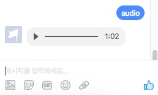
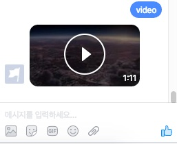
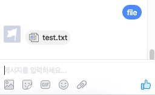
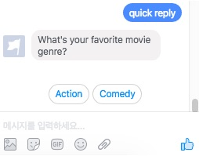
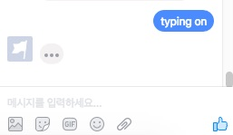
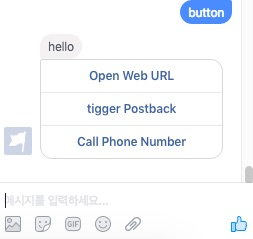
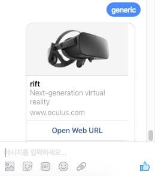
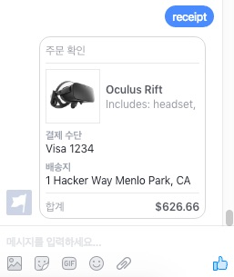

# (Deprecated Project)
## FBMQ (Facebook Messenger Platform Python Library)
[](https://pypi.python.org/pypi/fbmq)
[](https://travis-ci.org/conbus/fbmq)
[](https://coveralls.io/github/conbus/fbmq?branch=master)
[](https://pypi.python.org/pypi/fbmq)

A Python Library For Using The Facebook Messenger Platform API (Python Facebook Chat & Chatbot Library)
Facebook messenger platform api full features are supported
## Table of Contents

* [Install](#install)
* [Handle webhook](#handle-webhook)
  * [usage (with flask)](#usage-with-flask)
  * [handlers](#handlers)
* [Send a message](#send-a-message)
  * [basic](#basic)
    * [text](#text)
    * [image](#image) / [audio](#audio) / [video](#video) / [file](#file)
    * [quick reply](#quick-reply)
      * [quick reply callback](#quick-reply-callback)
    * [typing on/off](#typing-onoff)
  * [templates](#templates)
    * [button](#template--button)
      * [button callback](#button-callback)
    * [generic](#template--generic)
    * [receipt](#template--receipt)
  * [options](#options)
    * [notification type](#notification-type)
    * [callback](#callback) 
* [Thread settings](#thread-settings)
  * [greeting text](#greeting-text)
  * [get started button](#get-started-button)
  * [persistent menu](#persistent-menu)
* [Fetch user/page profile](#fetch-userpage-profile)
* [Example](#example)


# Install
```
pip install fbmq
```

# Handle webhook
how to handle messages from user to facebook page

### Usage (with flask)
```python
from flask import Flask, request
from fbmq import Page

page = Page(PAGE_ACCESS_TOKEN)

@app.route('/webhook', methods=['POST'])
def webhook():
  page.handle_webhook(request.get_data(as_text=True))
  return "ok"

@page.handle_message
def message_handler(event):
  """:type event: fbmq.Event"""
  sender_id = event.sender_id
  message = event.message_text
  
  page.send(sender_id, "thank you! your message is '%s'" % message)

@page.after_send
def after_send(payload, response):
  """:type payload: fbmq.Payload"""
  print("complete")
```

### handlers
A spec in detail - https://developers.facebook.com/docs/messenger-platform/webhook-reference

`@page.handle_message` - This callback will occur when a message has been sent to your page. (`quick reply` is also handled in here)

`@page.handle_echo` - This callback will occur when a message has been sent by your page

`@page.handle_delivery` - This callback will occur when a message a page has sent has been delivered.

`@page.handle_optin` - This callback will occur when the [Send-to-Messenger](https://developers.facebook.com/docs/messenger-platform/plugin-reference/send-to-messenger) plugin has been tapped

`@page.handle_postback` - Postbacks occur when a Postback button, Get Started button, Persistent menu or Structured Message is tapped.

`@page.handle_read` - This callback will occur when a message a page has sent has been read by the user.

`@page.handle_account_linking` - This callback will occur when the Linked Account or Unlink Account call-to-action have been tapped.

`@page.after_send` - This callback will occur when page.send function has been called.

#### Event parameter (fbmq.Event class)

`event.sender_id` _str_ : message sender id, user id

`event.recipient_id` _str_ : message receiver id, page id

`event.timestamp` _number_ : timestamp when message is received

`event.message` _dict_ : message dict that is received. [more detail](https://developers.facebook.com/docs/messenger-platform/webhook-reference/message-received)

`event.message_text` _str_ : `event.message.get('text')`

`event.message_attachments` _str_ : `event.message.get('attachments')`

`event.quick_reply` _dict_ : quick reply dict that is received. [more detail](https://developers.facebook.com/docs/messenger-platform/webhook-reference/message-received)

`event.quick_reply_payload` _str_ : `event.quick_reply.get('payload')

`event.postback` _dict_ : postback dict that is received. [more detail](https://developers.facebook.com/docs/messenger-platform/webhook-reference/postback-received)

`event.postback_payload` _str_ : `event.postback.get('payload')

`event.optin` _dict_ : dict that is received. [more detail](https://developers.facebook.com/docs/messenger-platform/webhook-reference/authentication)

`event.account_linking` _dict_: dict that is received. [more detail](https://developers.facebook.com/docs/messenger-platform/account-linking)

`event.delivery` _dict_: dict that is received. [more detail](https://developers.facebook.com/docs/messenger-platform/webhook-reference/message-delivered)

`event.read` _dict_: dict that is received. [more detail](https://developers.facebook.com/docs/messenger-platform/webhook-reference/message-read)


`event.is_*` _bool_ - True if event type is valid

#### if you don't need a decorator
```python
page = fbmq.Page(PAGE_ACCESS_TOKEN, after_send=after_send)

@app.route('/webhook', methods=['POST'])
def webhook():
  page.handle_webhook(request.get_data(as_text=True),
                      message=message_handler)
  return "ok"

def message_handler(event):
  """:type event: fbmq.Event"""
  sender_id = event.sender_id
  message = event.message_text
  
  page.send(sender_id, "thank you! your message is '%s'" % message)

def after_send(payload, response):
  """:type event: fbmq.Payload"""
  print("complete")
```

# Send a message
how to send a message from facebook page to user

### Basic

##### Import
```python
from fbmq import Attachment, Template, QuickReply, Page
```

##### Text
```python
page.send(recipient_id, "hello world!")
```


##### Image
jpg, png, gif support
```python
page.send(recipient_id, Attachment.Image(image_url))
```


##### Audio
```python
page.send(recipient_id, Attachment.Audio(audio_url))
```

##### Video
```python
page.send(recipient_id, Attachment.Video(video_url))
```


##### File
```python
page.send(recipient_id, Attachment.File(file_url))
```


##### quick reply
```python
quick_replies = [
  QuickReply(title="Action", payload="PICK_ACTION"),
  QuickReply(title="Comedy", payload="PICK_COMEDY")
]

# you can use a dict instead of a QuickReply class
#
# quick_replies = [{'title': 'Action', 'payload': 'PICK_ACTION'},
#                {'title': 'Comedy', 'payload': 'PICK_COMEDY'}]


page.send(recipient_id, 
          "What's your favorite movie genre?",
          quick_replies=quick_replies,
          metadata="DEVELOPER_DEFINED_METADATA")
```

##### quick reply callback
you can define easily a quick reply callback method.
```python
@page.callback(['PICK_ACTION', 'PICK_COMEDY'])
def callback_picked_genre(payload, event):
  print(payload, event)
  
# Also supported regex, it works corretly
# @page.callback(['PICK_(.+)'])
```

if you want to handle only quick_reply callback without button postback
```python
@page.callback(['PICK_ACTION', 'PICK_COMEDY'], types=['QUICK_REPLY'])
```

##### typing on/off
```python
page.typing_on(recipient_id)
page.typing_off(recipient_id)
```


### Templates

##### Template : Button
```python
buttons = [
  Templates.ButtonWeb("Open Web URL", "https://www.oculus.com/en-us/rift/"),
  Templates.ButtonPostBack("trigger Postback", "DEVELOPED_DEFINED_PAYLOAD"),
  Templates.ButtonPhoneNumber("Call Phone Number", "+16505551234")
]

# you can use a dict instead of a Button class
#
# buttons = [{'type': 'web_url', 'title': 'Open Web URL', 'value': 'https://www.oculus.com/en-us/rift/'},
#          {'type': 'postback', 'title': 'trigger Postback', 'value': 'DEVELOPED_DEFINED_PAYLOAD'},
#          {'type': 'phone_number', 'title': 'Call Phone Number', 'value': '+16505551234'}]

page.send(recipient_id, Template.Buttons("hello", buttons))
```

##### button callback
you can define easily a button postback method (it works only postback type buttons).
```python
@page.callback(['DEVELOPED_DEFINED_PAYLOAD'])
def callback_clicked_button(payload, event):
  print(payload, event)
  
# Also supported regex, it works corretly
# @page.callback(['DEVELOPED_DEFINE(.+)'])
```

if you want to handle only button's postback without quick_reply callback
```python
@page.callback(['DEVELOPED_DEFINED_PAYLOAD'], types=['POSTBACK'])
```


##### Template : Generic
```python
page.send(recipient_id, Template.Generic([
  Template.GenericElement("rift",
                          subtitle="Next-generation virtual reality",
                          item_url="https://www.oculus.com/en-us/rift/",
                          image_url=CONFIG['SERVER_URL'] + "/assets/rift.png",
                          buttons=[
                              Template.ButtonWeb("Open Web URL", "https://www.oculus.com/en-us/rift/"),
                              Template.ButtonPostBack("tigger Postback", "DEVELOPED_DEFINED_PAYLOAD"),
                              Template.ButtonPhoneNumber("Call Phone Number", "+16505551234")
                          ]),
  Template.GenericElement("touch",
                          subtitle="Your Hands, Now in VR",
                          item_url="https://www.oculus.com/en-us/touch/",
                          image_url=CONFIG['SERVER_URL'] + "/assets/touch.png",
                          buttons=[
                              Template.ButtonWeb("Open Web URL", "https://www.oculus.com/en-us/rift/"),
                              Template.ButtonPostBack("tigger Postback", "DEVELOPED_DEFINED_PAYLOAD"),
                              Template.ButtonPhoneNumber("Call Phone Number", "+16505551234")
                          ])
]))
```


##### Template : Receipt
```python
    element = Template.ReceiptElement(title="Oculus Rift",
                                      subtitle="Includes: headset, sensor, remote",
                                      quantity=1,
                                      price=599.00,
                                      currency="USD",
                                      image_url=CONFIG['SERVER_URL'] + "/assets/riftsq.png"
                                      )

    address = Template.ReceiptAddress(street_1="1 Hacker Way",
                                      street_2="",
                                      city="Menlo Park",
                                      postal_code="94025",
                                      state="CA",
                                      country="US")

    summary = Template.ReceiptSummary(subtotal=698.99,
                                      shipping_cost=20.00,
                                      total_tax=57.67,
                                      total_cost=626.66)

    adjustment = Template.ReceiptAdjustment(name="New Customer Discount", amount=-50)

    page.send(recipient_id, Template.Receipt(recipient_name='Peter Chang',
                                            order_number='1234',
                                            currency='USD',
                                            payment_method='Visa 1234',
                                            timestamp="1428444852",
                                            elements=[element],
                                            address=address,
                                            summary=summary,
                                            adjustments=[adjustment]))
```
### Options

##### notification type
support notification_type as a option

`NotificationType.REGULAR (default)`, `NotificationType.SILENT_PUSH`, `NotificationType.NO_PUSH`

```
page.send(recipient_id, 'hello', notification_type=NotificationType.NO_PUSH)
```
##### callback
you can set a callback function to each `page.send`
```
def callback(payload, response):
  print('response : ' + response.text)
  
page.send(recipient_id, 'hello', callback=callback)
```

# Thread settings
### Greeting text
```python
page.greeting("Welcome!")
```

### Get started button
```python
page.show_starting_button("START_PAYLOAD")

@page.callback(['START_PAYLOAD'])
def start_callback(payload, event):
  print("Let's start!")
```

### Persistent menu
```python
page.show_persistent_menu([Template.ButtonPostBack('MENU1', 'MENU_PAYLOAD/1'),
                           Template.ButtonPostBack('MENU2', 'MENU_PAYLOAD/2')])

@page.callback(['MENU_PAYLOAD/(.+)'])
def click_persistent_menu(payload, event):
  click_menu = payload.split('/')[1]
  print("you clicked %s menu" % click_menu)
```

# Fetch user/page profile
```
page_id = page.page_id
page_name = page.page_name
user_profile = page.get_user_profile(event.sender_id) # return dict
print(user_profile)

#{"first_name":"...", "last_name":"...", "profile_pic":"...", "locale":"...", "timezone":9, "gender":"..."}
```

# Example

1. fill example/config.py
2. run server
```bash
cd example
virtualenv env
source env/bin/activate
pip install -r requirements.txt
python server.py
```










